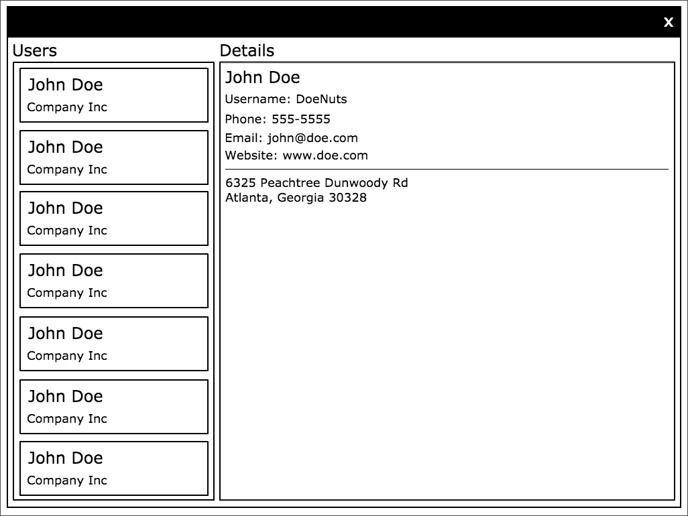

# User Depot

> Based on the typescript react project [UserDepot](https://github.com/getsaf/user-depot-ts)

This project was generated with [Angular CLI](https://github.com/angular/angular-cli) version 12.0.2.

Your mission (should you choose to accept it) is to call out to an API that returns a list of users, and display the information similar to this mockup.

The API is here: [https://jsonplaceholder.typicode.com/users](https://jsonplaceholder.typicode.com/users).

We've already included Angular along with a few basic components for structure and layout. Feel free to change anything about what we've provided; it's completely up to you how you want to go about it.

To start a development server, just run `npm start` or `yarn start`.

## Extra Credit

1. Sort the User List alphabetically by last name
2. Add a Loading Spinner to the User List at the appropriate time

## Development server

Run `ng serve` for a dev server. Navigate to `http://localhost:4200/`. The app will automatically reload if you change any of the source files.

## Code scaffolding

Run `ng generate component component-name` to generate a new component. You can also use `ng generate directive|pipe|service|class|guard|interface|enum|module`.

## Build

Run `ng build` to build the project. The build artifacts will be stored in the `dist/` directory.

## Running unit tests

Run `ng test` to execute the unit tests via [Karma](https://karma-runner.github.io).

## Running end-to-end tests

Run `ng e2e` to execute the end-to-end tests via a platform of your choice. To use this command, you need to first add a package that implements end-to-end testing capabilities.

## Further help

To get more help on the Angular CLI use `ng help` or go check out the [Angular CLI Overview and Command Reference](https://angular.io/cli) page.
